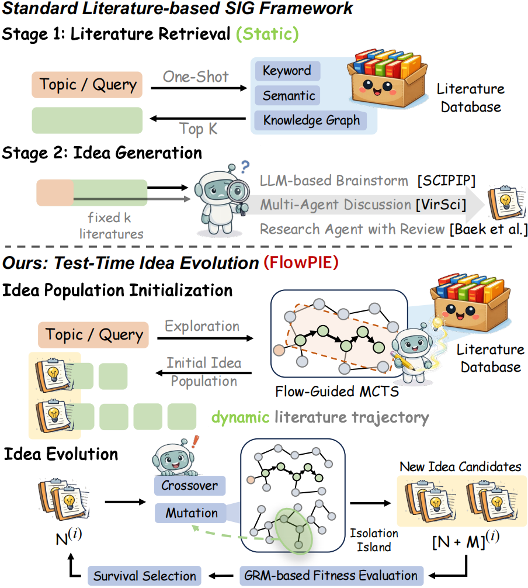

<p align="center">
  
</p>

<h3 align="center"><strong>FlowPIE</strong>: Test-Time Scientific Idea Evolution
with Flow-Guided Literature Exploration</h3>

<p align="center">
  <a href="wangqiyao.me">Qiyao Wang</a><sup>1,2,*</sup>, Hongbo Wang<sup>3,*</sup>, Longze Chen<sup>1,2</sup>, Zhihao Yang<sup>1,2</sup>, Guhong Chen<sup>1</sup> <br> Hui Li<sup>6</sup>, Hamid Alinejad-Rokny<sup>4</sup>, Yuan Lin<sup>3,†</sup>, Min Yang<sup>1,5,†</sup>
</p>

<p align="center">
  <sup>1</sup>SIAT-NLP, <sup>2</sup>UCAS, <sup>3</sup>DUT-IR, <sup>4</sup>UNSW Sydney, <sup>5</sup>SUAT and <sup>6</sup>XMU
</p>

<p align="center">
  <sup>*</sup> Equal Contribution &nbsp;&nbsp; <sup>†</sup> Corresponding Authors
</p>

<p align="center">
  <a href="https://flowpie.wangqiyao.me/">🌐 Homepage</a> |
  <a href="">🤗 Dataset</a> |
  <a href="https://arxiv.org/pdf/2603.29557">📖 Paper</a> |
  <a href="https://github.com/AIforIP/FlowPIE">GitHub</a>
</p>


This repo contains the evaluation code for the paper "[FlowPIE: Test-Time Scientific Idea Evolution with Flow-Guided Literature Exploration](https://arxiv.org/pdf/2603.29557)"

## 🔔 News

- 📑 [2026-04-01]: Releasing [Preprint](https://arxiv.org/pdf/2603.29557).
- 😄 [2026-03-25]: Releasing [Website](https://flowpie.wangqiyao.me/).
- 🔥 [2026-01-01] Research Begining.

## 📅 Timeline

- [x] Code
- [ ] Literature Database (comming soon)


## 📝 Introduction



Currently, many **AI for Research / Auto Research** efforts aim to cover the entire scientific workflow—from literature retrieval to paper writing. In contrast, we focus on the most fundamental and open-ended front-end problem: **Scientific Idea Generation**. Unlike the traditional pipeline of *"literature retrieval → large model generation,"* FlowPIE decomposes scientific innovation into two key stages: **a high-quality initial population** and **a continuous evolution process**.

First, inspired by GFlowNet, we propose a **Flow-Guided MCTS** to dynamically explore the literature graph. By using idea quality as a feedback signal to guide exploration paths, we construct an initial population of ideas that is **high-quality, diverse, and cross-disciplinary** from the outset. Notably, even the initial population alone significantly outperforms existing methods, serving as a very strong starting point.

However, we further observe that relying solely on continued exploration from the initial population quickly leads to a **reward plateau**—as exploration becomes saturated, gains diminish, making it difficult to further improve idea novelty and feasibility.

To address this, FlowPIE introduces an explicit **test-time idea evolution** mechanism. Through **selection, structured crossover, and cross-domain mutation via "islands,"** the system continuously refines existing ideas while injecting new information. This enables the process to escape local optima and sustain innovation through iterative exploration and feedback, rather than being confined to incremental refinements along existing paths.

## ✨ Highlights 

🌟 We summarize three key contributions:

1️⃣ **Flow-Guided Initialization Mechanism**  
Constructs a high-quality initial population through exploration and feedback, significantly improving both the starting point and the upper bound

2️⃣ **Idea Evolution Framework**  
Addresses exploration bottlenecks by introducing selection, crossover, and cross-domain mutation, enabling sustained innovation and breakthroughs

3️⃣ **Test-time Scaling of Ideas**  
Demonstrates that idea generation exhibits test-time scaling properties: *more compute → higher-quality ideas*

📈 Experimentally, we observe several key phenomena:

- The initial population itself is highly competitive, even surpassing multiple LLM- and agent-based baselines
- Pure exploration (Flow-Guided MCTS) exhibits a clear reward plateau, with diminishing returns
- Introducing evolution continuously breaks this bottleneck, shifting the reward distribution toward higher-quality regions and achieving more stable convergence
- The overall process exhibits a clear test-time scaling curve: initial exploration fluctuations → evolutionary improvement → final stable convergence
- Compared to naive test-time scaling (which often leads to redundancy and mode collapse), FlowPIE consistently improves coverage of the idea space
- Across multiple benchmarks and human evaluations, FlowPIE significantly outperforms existing methods in **novelty, feasibility, and diversity**


## 🚀 Quick start 

Create & activate the conda environment (we use a conda env named `flowpie`):

```bash
conda create -n flowpie python=3.11 
conda activate flowpie
pip install -r requirements.txt
```

Before running the code, please make sure you have filled in all the configuration information in the config fileq.

Run Phase 1 (flow-guided MCTS). Phase1 provides a module entrypoint:

```bash
python -m src.phase1.main
```

Run Phase 2 (test-time evolution). Phase2 provides a module entrypoint:

```bash
python -m src.phase2.main
```


## Citation

When citing this work, please use the following BibTeX entry:

```bibtex

```

## Contact
Feel free to contact the author with `wangqiyao25@mails.ucas.ac.cn`.


