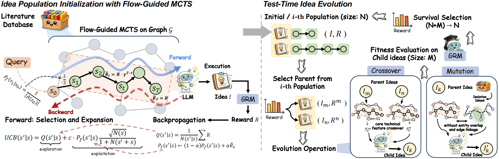

<p align="center">
  
</p>

<h3 align="center"><strong>FlowPIE</strong>: Test-Time Scientific Idea Evolution
with Flow-Guided Literature Exploration</h3>

<p align="center">
  <a href="wangqiyao.me">Qiyao Wang</a><sup>1,2,*</sup>, Hongbo Wang<sup>3,*</sup>, Longze Chen<sup>1,2</sup>, Zhihao Yang<sup>1,2</sup>, Guhong Chen<sup>1</sup> <br> Hui Li<sup>6</sup>, Hamid Alinejad-Rokny<sup>4</sup>, Yuan Lin<sup>3,†</sup>, Min Yang<sup>1,5,†</sup>
</p>

<p align="center">
  <sup>1</sup>SIAT-NLP, <sup>2</sup>UCAS, <sup>3</sup>DUT-IR, <sup>4</sup>UNSW Sydney, <sup>5</sup>SUAT and <sup>6</sup>XMU
</p>

<p align="center">
  <sup>*</sup> Equal Contribution &nbsp;&nbsp; <sup>†</sup> Corresponding Authors
</p>

<p align="center">
  <a href="https://flowpie.wangqiyao.me/">🌐 Homepage</a> |
  <a href="">🤗 Dataset</a> |
  <a href="https://arxiv.org/abs/">📖 Paper</a> |
  <a href="https://github.com/AIforIP/FlowPIE">GitHub</a>
</p>


This repo contains the evaluation code for the paper "[FlowPIE: Test-Time Scientific Idea Evolution with Flow-Guided Literature Exploration](https://arxiv.org/abs/)"

## 🔔 News

- 😄 [2026-03-25]: Releasing [Website](https://flowpie.wangqiyao.me/).
- 🔥 [2026-01-01] Research Begining.


## 📝 Introduction 

## ✨ Highlights 

- Flow-guided MCTS: expand promising literature trajectories using flow-based scores (GFlowNet-inspired).
- GRM (Generative Reward Model): LLM-based evaluator to score ideas and guide both retrieval and evolution.
- Idea evolution at test time: selection, crossover, mutation with isolation-island parallelism to encourage cross-domain mixing and diversity.
- Provide detailed ideas, with verifiable experimental design plans.



## 🚀 Quick start 

Create & activate the conda environment (we use a conda env named `flowpie`):

```bash
conda create -n flowpie python=3.11 
conda activate flowpie
pip install -r requirements.txt
```

Before running the code, please make sure you have filled in all the configuration information in the config fileq.

Run Phase 1 (flow-guided MCTS). Phase1 provides a module entrypoint:

```bash
python -m src.phase1.main
```

Run Phase 2 (test-time evolution). Phase2 provides a module entrypoint:

```bash
python -m src.phase2.main
```


## Citation

When citing this work, please use the following BibTeX entry:

```bibtex

```

## Contact
`wangqiyao25@mails.ucas.ac.cn`


