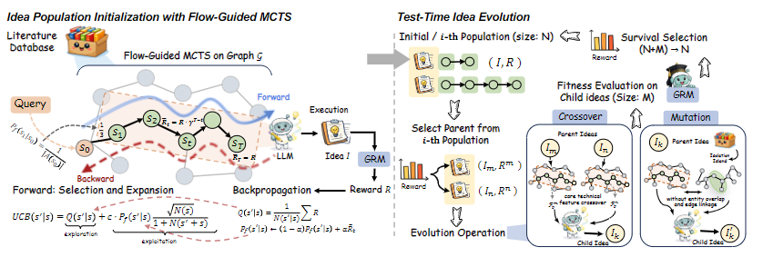

<h3 align="center"></h3>

<h3 align="center"><strong>FlowPIE</strong>: A Test-Time Scientific Idea Evolution
with Flow-Guided Literature Exploration</h3>

FlowPIE is a new framework for autonomous scientific idea generation. This repository contains code, small example data and utilities used to produce the ideas in the paper.

## Instruction 📝

Scientific idea generation (SIG) is essential for AI-driven autonomous research, but many existing methods follow a static retrieval-then-generation pipeline that yields homogeneous and insufficiently diverse ideas. FlowPIE treats literature exploration and idea generation as a co-evolving process. It expands literature trajectories via a flow-guided Monte Carlo Tree Search (MCTS) inspired by GFlowNets, and uses a generative reward model (GRM) based on a large language model (LLM) to assess idea quality. The GRM provides a supervised signal that guides adaptive retrieval and constructs a diverse, high-quality initial idea population. Idea generation is then modeled as a test-time evolutionary process (selection, crossover, mutation) using an isolation-island paradigm and GRM-based fitness computation to incorporate cross-domain knowledge. FlowPIE promotes diversity, mitigates information cocoons caused by parametric priors and static retrieval, and supports test-time reward scaling. Extensive experiments show FlowPIE yields ideas with higher novelty, feasibility and diversity than strong LLM and agent-based baselines.

## Highlights ✨

- Flow-guided MCTS: expand promising literature trajectories using flow-based scores (GFlowNet-inspired).
- GRM (Generative Reward Model): LLM-based evaluator to score ideas and guide both retrieval and evolution.
- Idea evolution at test time: selection, crossover, mutation with isolation-island parallelism to encourage cross-domain mixing and diversity.
- Provide detailed ideas, with verifiable experimental design plans.

## Method Overview📖



Given the input topic, FlowPIE first explores a literature space composed of patents and related technical documents. Starting from the topic node, the search expands multiple paths, each consisting of several patents that provide potential technical inspirations. At the end of each path, the system generates a candidate idea conditioned on the collected patent context.

Each generated idea is automatically evaluated to produce a score that serves as the reward signal for updating the path flow probabilities in the MCTS process. After exploration, the top-5 highest-scoring ideas are selected as the initial population for the evolutionary stage. By incorporating patent-island information, the framework performs multiple rounds of crossover and mutation among the initial ideas to promote novel recombinations. Through this process, the system ultimately produces five high-quality scientific ideas.

## Quick start 🚀

Create & activate the conda environment (we use a conda env named `flowpie`):

```bash
conda create -n flowpie python=3.11 
conda activate flowpie
pip install -r requirements.txt
```

Before running the code, please make sure you have filled in all the configuration information in the config fileq.

Run Phase 1 (flow-guided MCTS). Phase1 provides a module entrypoint:

```bash
python -m src.phase1.main
```

Run Phase 2 (test-time evolution). Phase2 provides a module entrypoint:

```bash
python -m src.phase2.main
```


## Citation

When citing this work, please use the following BibTeX entry (placeholder):

<!-- ```bibtex
@inproceedings{flowpie-2026,
	title = {FlowPIE: Flow-guided Retrieval–Generation for Scientific Idea Generation},
	author = {Author List},
	booktitle = {ACL ARR 2026},
	year = {2026}
}
``` -->

## Contact & contribution


## License


